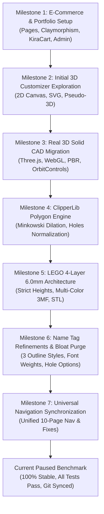

# PROJECT_WALKTHROUGH.md - Kira's Creation Soft-3D Studio Engineering Log

> **Document Purpose:** Complete historical trajectory, architectural breakdown, algorithm specifications, and continuation guide for Kira's Creation Soft-3D Studio.  
> **Repository:** `https://github.com/Muhammadibrahim543/3d-website.git`  
> **Status as of Sep 15, 2026:** All Milestones 1–6 complete & verified. Production ready on branch `main`.

---

## 1. Chronological Trajectory of Development



---

### Milestone 1: E-Commerce Storefront & Portfolio Foundation
- **Goal:** Launch the official digital presence for Kira's Creation Soft-3D Studio.
- **Key Deliverables:**
  - Designed a modern Claymorphic UI system using CSS variables, soft inner/outer drop shadows, and warm organic color palettes.
  - Multi-page responsive website: `index.html`, `portfolio.html`, `services.html`, `materials.html`, `pricing.html`, `about.html`, `contact.html`, `account.html`, and `admin.html`.
  - Built **KiraCart** (`js/cart.js`): slide-out drawer, live badge counter, LocalStorage cart items, and custom order spec summary.
  - Built **Admin Dashboard** (`admin.html` & `js/admin.js`): PIN protection (`1234`), order pipeline tracking, product catalog CRUD with search/filter/pagination, and Google Sheets Apps Script webhook sync.
  - Curated 13+ flagship 3D printed products with dual-language specs and pricing (e.g. Architectural Scale Model 3D Cottage with Balcony set to ৳990).

---

### Milestone 2: 3D Customizer Concept & Initial Prototyping
- **Goal:** Allow customers to personalize keychains and nameplates with live visual feedback.
- **Initial Approach & Bottlenecks:**
  - Began with layered SVG rendering and 2D canvas extrusion tricks.
  - Limitation: Flat 2.5D representations could not be exported to true watertight 3D files (STL/3MF) for manufacturing, and camera perspective was constrained.

---

### Milestone 3: Real 3D Solid CAD Engine Migration (Three.js WebGL)
- **Goal:** Provide true CAD-grade solid modeling directly in the browser.
- **Implementation Details:**
  - Integrated **Three.js** with WebGL rendering, ACES Filmic tone mapping, and directional shadow maps.
  - Standardized coordinate system to CAD standard: **$Z$ is UP**, $X$ is horizontal, $Y$ is vertical.
  - Interactive **OrbitControls**: 360° rotation, smooth panning, and pinch/wheel zoom centered at object centroid.
  - Binary **STL Exporter** (`js/three/STLExporter.js`) allowing users to download print-ready slices immediately.

---

### Milestone 4: Vector Contour Engine & ClipperLib Integration
- **Goal:** Eliminate pixelated stair-stepping and boxy rectangular pill outlines.
- **Mathematical Advancements:**
  - Integrated **ClipperLib** (`js/clipper.js`) for exact 2D polygon offsetting (Minkowski Sum dilation).
  - Normalization with EvenOdd winding rules to accurately preserve counter-glyphs / interior holes (e.g., in letters 'O', 'A', 'B', 'P', 'R', 'D', '@', '&').
  - Implemented **Chaikin's Corner-Cutting algorithm** for continuous, organic curvature around letters.
  - Solved font loader script blocking issue (`wwindow.` typo in `helvetiker_bold.js` and `optimer_bold.js`).

---

### Milestone 5: LEGO Keychain 4-Layer 6.0mm Elevation Architecture
- **Goal:** Exact replication of MakerWorld authentic 4-color filament swap keychains.
- **Elevation Specifications:**
  $$\begin{aligned}
  \text{Layer 1 (Base Plate):} & \quad Z = 0.0\text{ mm} \to 3.2\text{ mm} \quad (\Delta Z = 3.2\text{ mm}) \\
  \text{Layer 2 (Yellow Brim):} & \quad Z = 3.2\text{ mm} \to 4.2\text{ mm} \quad (\Delta Z = 1.0\text{ mm}) \\
  \text{Layer 3 (Black Outline):} & \quad Z = 4.2\text{ mm} \to 5.2\text{ mm} \quad (\Delta Z = 1.0\text{ mm}) \\
  \text{Layer 4 (White Letters):} & \quad Z = 5.2\text{ mm} \to 6.0\text{ mm} \quad (\Delta Z = 0.8\text{ mm}) \\
  \hline
  \textbf{Total Assembly Height:} & \quad \mathbf{6.0\text{ mm}}
  \end{aligned}$$
- **Bambu Studio Multi-Color 3MF Packaging:**
  - Using `JSZip`, packages watertight meshes into `/3D/3dmodel.model` with `<m:colorgroup>` definitions and per-object extruder assignments (Extruders 1 through 4).
  - OpenSCAD parametric code generator produces matching multi-color module difference/unions.

---

### Milestone 6: Customizable Name Tag Refinement & Studio Cleanup
- **Goal:** Remove bloated 2D canvas modal, fix font discrepancies, and enable versatile nameplate customization.
- **User Audio Directive:**
  - *"Remove the heavy 2D layout studio and element additives (heart, star, flower, paw) to eliminate UI lag."*
  - *"Ensure fonts render without mismatch, draw smooth organic outlines, and enable complete outline & geometry edits."*
- **Execution & Deliverables:**
  - Completely purged `#nametag-studio-modal`, `#acc-studio-elements`, and `js/nameTagElements.js`.
  - Added 3 distinct **Outline Styles**:
    1. 🫧 `Bubble Contour`: Organic letter-hugging curve (`JoinType.jtRound`).
    2. 💊 `Capsule Badge`: Sleek rounded pill / stadium badge.
    3. 📐 `Modern Chamfer`: Sharp geometric mitered outline (`JoinType.jtMiter`).
  - Added **Font Weight Parser** (`getFontWeight`): Accurately matches 400, 700, 800, and 900 weights for Google Fonts, with `await document.fonts.load()` pre-caching.
  - Added **Two-Tone PLA Color Customization**: Base Color Swatch (Extruder 1) + Letter Color Swatch (Extruder 2).
  - Added **Keyring Hole Placement**: Left Eyelet, Right Eyelet, or None (Desk Display Tag) with X/Y fine adjustments.

---

### Milestone 7: Universal Navigation Menu Synchronization
- **Goal:** Ensure seamless page navigation across all 10 site documents.
- **Bug Fixed:** In `pricing.html`, the `Customize` link was missing from both desktop and mobile header menus.
- **Resolution:** Added `<a href="customize.html" data-i18n="nav_customize">Customize</a>` in identical menu ordering across all pages.

---

## 2. Technical Architecture of Core 3D CAD Engine (`js/customize.js`)

### A. State Machine & Parameter Dictionary
```javascript
const params = {
    text: "KIRA",            // Input string (sanitized)
    textSize: 18,            // Letter height in mm (10.0 - 32.0 mm)
    baseThick: 3.2,          // Base plate thickness (1.0 - 8.0 mm)
    letterThick: 0.8,        // Raised text relief (0.4 - 4.0 mm)
    outlineSize: 4.5,        // Offset dilation margin (0.8 - 10.0 mm)
    holeSize: 5.0,           // Keychain eyelet hole diameter (2.0 - 10.0 mm)
    holeX: 0.0,              // Horizontal eyelet shift (-15.0 to +15.0 mm)
    holeY: 0.0,              // Vertical eyelet shift (-15.0 to +15.0 mm)
    spaceWidth: 1.0,         // Letter kerning/spacing (0.0 - 4.0 mm)
    outlineStyle: 'bubble',  // 'bubble' | 'capsule' | 'chamfer'
    letterColor: '#FFFFFF',  // Secondary text hex color
    holePlacement: 'left'    // 'left' | 'right' | 'none'
};
```

### B. Manifold Mesh Welder Algorithm (3MF & STL Export)
To prevent non-manifold edges, self-intersecting facets, and slicer warnings, `download3MF` and `downloadSTL` execute an exact vertex clustering weld:
1. Coordinates are scaled by a precision multiplier of $10,000$ ($0.0001\text{ mm}$ tolerance).
2. Unique vertices are indexed via hash map `rx_ry_rz`.
3. Coincident vertices share single index pointers, creating a $100\%$ watertight manifold topological boundary representation.
4. Degenerate triangular faces (area $= 0$) are rejected.

---

## 3. Current Benchmark & Where the Project is Paused

| Component | Status | Verification Check |
| :--- | :--- | :--- |
| **`customize.html` (LEGO Model)** | 🟢 100% Complete | 4-layer 6.0mm elevation renders, export verified. |
| **`customize.html` (Name Tag Model)** | 🟢 100% Complete | 3 outline styles, 2-tone swatches, hole positions verified. |
| **Bambu Studio 3MF Export** | 🟢 100% Complete | Generates AMS multi-extruder package with color metadata. |
| **Binary STL Export** | 🟢 100% Complete | Single manifold binary mesh for universal slicers. |
| **OpenSCAD Code Generation** | 🟢 100% Complete | Generates parametric `.scad` script with live variables. |
| **Site Navigation & UI** | 🟢 100% Complete | All 10 HTML pages synchronized. |
| **Admin Operations Portal** | 🟢 100% Complete | PIN `1234`, order queue, product management. |
| **Git Repository** | 🟢 Up-to-Date | Branch `main` pushed to remote `origin`. |

---

## 4. Next Engineering Steps (Roadmap)

When resuming development, the following enhancements are queued:
1. **Template Expansion:**
   - Add Template 3: `Desk Nameplate with Stand.scad` (45-degree angled face with snap-fit interlocking legs).
   - Add Template 4: `Luggage Tag.scad` (Front personalization + back recess for physical address card).
2. **Preset Link Generator:**
   - Encode customizer configuration into URL hash (`customize.html#m=nametag&t=KIRA&os=capsule...`) for instant viral sharing.
3. **Automated Price Matrix for Bulk Orders:**
   - Tiered discounts for school/corporate custom name tag orders ($>20$ units).
